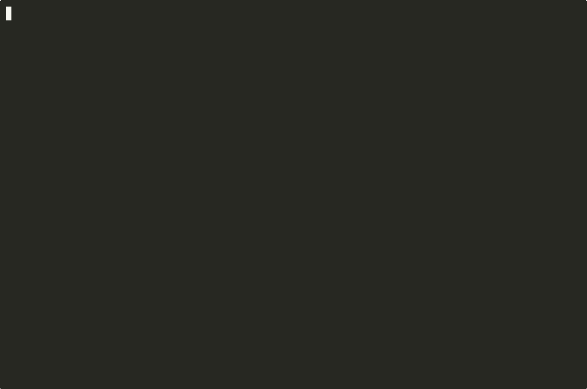

# MiniDB

MiniDB is a from-scratch relational database engine in C++17. The storage format, the executor, and the B+ tree are in this repository. It parses a small SQL subset, stores tables and indexes in a 4 KiB page file, and can say whether a `SELECT` will scan the heap or use an index.

It is not a client or wrapper for PostgreSQL, SQLite, or any other database. It is not a server, and it does not speak their wire protocols. It has no transactions, no concurrent writers, and no write-ahead log.

## Why

This is the systems piece of a CS portfolio, after WorthIt and ThreatLens. Those projects sit higher in the stack. MiniDB is the one that has to deal with files, memory, and query execution directly, in the open, one milestone at a time.

## Status

**M5 — EXPLAIN, a measured point lookup, and this README.** The shell parses one SQL statement and runs it against a database file. `CREATE TABLE`, `DROP TABLE`, `CREATE INDEX`, `DROP INDEX`, `INSERT`, `SELECT`, `UPDATE`, and `DELETE` work, including `WHERE`. Tables, rows, and indexes survive process exit. `.explain` prints `Seq Scan` or `Index Scan`, the index name, and the filter when there is one. It does not estimate a cost. The default file is `minidb.db` in the current directory.

The on-disk layout is [docs/storage.md](docs/storage.md). The B+ tree is [docs/index.md](docs/index.md).

## Milestones

| Milestone | Scope | Status |
| --- | --- | --- |
| M0 | CMake, CLI stub, GoogleTest, CI | Done |
| M1 | Lexer, parser, and AST for a tiny SQL subset | Done |
| M2 | In-memory catalog and execution, including `WHERE` | Done |
| M3 | On-disk 4 KiB pages so data survives restart | Done |
| M4 | B+ tree index and a trivial access-path choice | Done |
| M5 | EXPLAIN text, a measured point lookup, portfolio docs | Done |

The parser does not execute statements. The executor reads and writes rows through the storage layer, which keeps heap pages and B+ tree pages in the same file.

## Build

Requirements: a C++17 compiler (g++ or clang++), CMake 3.16+, and network on the first configure when tests are enabled.

```bash
cmake -S . -B build -DCMAKE_BUILD_TYPE=Debug
cmake --build build
cd build && ctest --output-on-failure
```

The binary is `build/minidb`.

GoogleTest is not a git submodule and it is not vendored. `FetchContent` pins the v1.15.2 release archive in `CMakeLists.txt` (URL plus SHA256). The first configure needs network access so CMake can download the archive. Later configures reuse CMake's fetch cache. Pass `-DBUILD_TESTING=OFF` to skip the download and build only the CLI.

## Demo

The GIF is a real CLI session: a point lookup is a Seq Scan, `CREATE INDEX` makes the same lookup an Index Scan, and reopening the file still uses that index.



The same session is [minidb-demo.mp4](docs/demo/minidb-demo.mp4). The lines from the recording are [examples/minidb-demo-transcript.txt](examples/minidb-demo-transcript.txt). The text below is that session with `.indexes` added.

```bash
rm -f /tmp/minidb-demo.db
./build/minidb /tmp/minidb-demo.db
```

```text
MiniDB v0.1
Database: /tmp/minidb-demo.db
MiniDB> CREATE TABLE users (id INT, name TEXT, active BOOLEAN, score FLOAT);
Created table users.
MiniDB> INSERT INTO users VALUES (1, 'ada', TRUE, 3.14);
Inserted 1 row.
MiniDB> INSERT INTO users VALUES (2, 'grace', FALSE, 10.0);
Inserted 1 row.
MiniDB> .explain SELECT id, name FROM users WHERE id = 1
Seq Scan on users
  Filter: id = 1
MiniDB> CREATE INDEX idx_id ON users (id);
Created index idx_id on users(id).
MiniDB> .indexes
idx_id ON users (id)
MiniDB> .explain SELECT id, name FROM users WHERE id = 1
Index Scan using idx_id on users
  Index Cond: id = 1
MiniDB> SELECT id, name FROM users WHERE id = 1;
id | name
---+-----
1  | ada
(1 row)
MiniDB> .exit
```

Start the shell again on that file. The table, the row, and the index are still there:

```text
$ ./build/minidb /tmp/minidb-demo.db
MiniDB v0.1
Database: /tmp/minidb-demo.db
MiniDB> .tables
users
MiniDB> .explain SELECT id, name FROM users WHERE id = 1
Index Scan using idx_id on users
  Index Cond: id = 1
MiniDB> SELECT * FROM users;
id | name  | active | score
---+-------+--------+------
1  | ada   | TRUE   | 3.14
2  | grace | FALSE  | 10.0
(2 rows)
MiniDB> .exit
```

`.explain` does not run the statement. `.EXPLAIN` is the same command. A longer session is in [examples/README.md](examples/README.md).

Each successful statement is flushed with `fflush` before the next prompt. That pushes the bytes to the operating system. It is not an `fsync`, and there is no log, so a crash or power loss can still lose or tear the last write. Details are in [docs/storage.md](docs/storage.md).

```bash
./build/minidb
./build/minidb --help
```

With no path, the file is `minidb.db` in the current directory.

## Benchmark

One Release run, 10,000 rows, in-memory, warm cache. Lookup: `SELECT id FROM t WHERE id = 5000`. Logical page reads count cache hits. Wall time is not disk I/O.

| | Sequential scan | Index scan |
| --- | --- | --- |
| Logical page reads | 10067 | 5 |
| 1000 warm lookups | 2180.865 ms | 10.621 ms |
| Mean per lookup | 2180.865 µs | 10.621 µs |

There were 1,000 repeats, so the millisecond total and the microsecond mean are the same quantity. Inserting the rows took 7.909 ms and `CREATE INDEX` took 127.887 ms on that same run.

Machine, compiler, and the raw program output are in [bench/results.md](bench/results.md). Reproduce with:

```bash
bash bench/run_point_lookup.sh
```

## SQL subset

Keywords are case-insensitive. Identifiers keep the spelling from the source and are matched case-sensitively (`Users` and `users` are different tables). The shell submits one line to the parser. A trailing semicolon is optional. The parser accepts newlines inside a statement when the whole statement is passed as one string; a statement split across shell lines is a parse error.

```text
statement    ::= create_table | drop_table | create_index | drop_index | insert | select | update | delete [ ";" ]
create_table ::= "CREATE" "TABLE" identifier "(" column_def ( "," column_def )* ")"
column_def   ::= identifier type_name
type_name    ::= "INT" | "TEXT" | "BOOLEAN" | "FLOAT"
drop_table   ::= "DROP" "TABLE" identifier
create_index ::= "CREATE" "INDEX" identifier "ON" identifier "(" identifier ")"
drop_index   ::= "DROP" "INDEX" identifier
insert       ::= "INSERT" "INTO" identifier "VALUES" "(" literal ( "," literal )* ")"
select       ::= "SELECT" ( "*" | identifier ( "," identifier )* ) "FROM" identifier [ where ]
update       ::= "UPDATE" identifier "SET" identifier "=" literal [ where ]
delete       ::= "DELETE" "FROM" identifier [ where ]
where        ::= "WHERE" identifier compare literal
compare      ::= "=" | "!=" | "<" | ">" | "<=" | ">="
literal      ::= integer | float | string | "TRUE" | "FALSE"
identifier   ::= [A-Za-z_][A-Za-z0-9_]*
integer      ::= [0-9]+
float        ::= [0-9]+ "." [0-9]* | "." [0-9]+
string       ::= "'" ( [^'] | "''" )* "'"
```

`TRUE` and `FALSE` are boolean literals. A doubled single quote inside a string is one quote character (`'it''s'` is `it's`). Keywords are reserved and cannot be used as names.

Not in this subset: `NULL`, `UNIQUE`, multi-column indexes, comments, joins, aliases, expressions, `ORDER BY`, `GROUP BY`, column lists on `INSERT`, multi-row `INSERT`, multiple `SET` assignments, qualified names, and quoted identifiers.

## Execution

The executor type-checks every literal against the column it writes or compares. There is no coercion.

| Column | Accepted literal |
| --- | --- |
| `INT` | integer (`1`, `007`) |
| `FLOAT` | float (`1.0`, `.5`, `10.`) |
| `TEXT` | string |
| `BOOLEAN` | `TRUE` or `FALSE` |

An integer literal is not a `FLOAT`. A failed `INSERT` or `UPDATE` does not change the table.

`WHERE` uses the same type rule. `INT` and `FLOAT` allow `=`, `!=`, `<`, `>`, `<=`, and `>=`. `FLOAT` compares the stored IEEE value with no tolerance. `TEXT` and `BOOLEAN` allow only `=` and `!=`. `TEXT` equality is byte-wise and case-sensitive (`'Ada'` is not `'ada'`). Ordering a `TEXT` or `BOOLEAN` column is an error.

A heap scan returns rows in insertion order. An index scan returns them in index order (the indexed column, then the row id). `SELECT` prints an aligned table and a row count. `.tables` lists names in lexicographic order. `.schema <table>` prints a one-line `CREATE TABLE` for that table. `.indexes` lists `name ON table (column)` in lexicographic order, or `(no indexes)`.

`CREATE INDEX name ON table (column)` builds a single-column B+ tree in the page file and fills it from the rows already stored. `DROP INDEX name` frees those pages. `INSERT`, `UPDATE`, and `DELETE` maintain every index on the table. `DROP TABLE` drops that table's indexes with it. Index names are case-sensitive and unique across the database. Duplicate column values are allowed. A `TEXT` value longer than 1024 bytes cannot be indexed. The node layout is in [docs/index.md](docs/index.md).

`.explain <sql>` prints the plan and does not run the statement. There is no cost model.

| Plan | When |
| --- | --- |
| `Seq Scan on <table>` plus `Filter: ...` | `SELECT` (or a writing statement that reads) walks the heap, and a `WHERE` clause is present |
| `Index Scan using <index> on <table>` plus `Index Cond: ...` | `WHERE` is `=`, `<`, `>`, `<=`, or `>=` and that column has an index |
| `Seq Scan on <table>` | a read with no `WHERE` |
| `No scan` | `CREATE`, `DROP`, `INSERT`, and `DELETE` without `WHERE` |

`!=` does not use an index. If several indexes cover the same column, the oldest is used. The predicate keeps the literal spelling from the statement. `UPDATE` and `DELETE` that read rows add a line that the write is not shown. `DELETE` without `WHERE` clears the heap instead of scanning it.

A mistake (missing table, duplicate table or column, unknown column, wrong `INSERT` arity, wrong type, illegal comparison) prints `Error: ...` and returns to the prompt. A syntax error still prints `Parse error at line:column: ...`. Neither exits the process.

| Input | Result |
| --- | --- |
| `.help` | Lists meta-commands |
| `.tables` | Table names, or `(no tables)` |
| `.schema <table>` | `CREATE TABLE ...` for that table |
| `.indexes` | Index list, or `(no indexes)` |
| `.explain <sql>` | Scan plan for one statement, without running it |
| `.exit`, `.quit` | Leaves the shell with status 0 |
| empty line | Another prompt; no error |
| one supported SQL statement | Runs it and prints a message or a result table |
| other non-meta input | `Parse error at line:column: ...` |
| a `.` command other than the ones above | `Unknown meta-command: ...` |

End of input (Ctrl-D) also exits with status 0. Meta-command names are case-insensitive. Table names and SQL are not. Surrounding whitespace is ignored.

## Test

```bash
cmake --build build
cd build && ctest --output-on-failure
```

`minidb_tests` covers the version string, the shell, the lexer, the parser, and execution: create, insert, select, update, delete, `WHERE` on each type, type and arity errors, drop, and schema listing. Storage tests cover page read/write, the free list, record and catalog bytes, and reopening a file after the `Database` object is destroyed. Index tests cover B+ tree splits, lookup, delete, reopen, maintenance under SQL, the EXPLAIN text, and a logical page-read comparison of a point lookup with and without an index.

## Layout

```text
include/minidb/     public headers (version, shell, tokens, AST, catalog, executor, pages, B+ tree)
src/main.cpp        process entry
src/cli/            shell implementation
src/parser/         lexer and parser
src/catalog/        table schema helpers and cell values
src/storage/        pager, slotted heap pages, record bytes
src/index/          B+ tree pages
src/executor/       statement execution and the scan choice
tests/              GoogleTest
bench/              point-lookup harness and one recorded run
benchmarks/         pointer at bench/
docs/               architecture, the heap file, the B+ tree, and the terminal demo
examples/           sample shell session, including a restart and the demo transcript
```

## Limitations

- A statement is flushed with `fflush` only. There is no `fsync`, no write-ahead log, and no atomic multi-page commit. A crash can tear a page or drop writes the kernel has not sent to disk. A multi-row `UPDATE` or `DELETE` can be left partly applied. See [docs/storage.md](docs/storage.md).
- No transactions and no rollback. A failed statement that throws before it writes leaves the table unchanged; a statement that writes several rows is not atomic.
- No concurrency. One writer, one thread. Opening the same file from two processes is undefined; the file is not locked.
- The only access-path choice is "index on this column" versus a heap scan. `!=`, a missing index, and a query with no `WHERE` scan the heap. `.explain` reports that choice. It does not estimate cost or cardinality.
- There is no buffer-pool eviction: pages that have been read stay in memory. The numbers in [bench/results.md](bench/results.md) count those cache hits. They are not disk latency.
- Indexes are not unique and not composite. Deletes do not refill an underfull node from its sibling. A crash can tear a page or leave an index and its heap out of agreement. See [docs/index.md](docs/index.md).
- A row, including its type tags, must fit on one 4 KiB page (4072 bytes of record payload).
- The file does not shrink. Dropped pages go on an in-file free list and are reused.
- No `NULL`, joins, expressions, `ORDER BY`, or multi-row `INSERT`.
- The shell submits one line to the parser. It does not accumulate a statement across lines.
- One process, stdin/stdout. There is no client/server protocol and no wire compatibility with PostgreSQL or MySQL.

## License

[MIT](LICENSE).
